  

  <!-- Uncomment once the portfolio is deployed, and replace the URL:
  
  -->
  
  
  
  

## About

I'm a **full-stack software engineer** and Computer Science (AI & ML) undergrad at **VIT Bhopal** (class of 2027, CGPA 8.67). I ship web apps end to end — typed React interfaces, secured REST APIs, relational schemas and containerized deploys — and I design **multi-agent LLM systems** on LangGraph and the Model Context Protocol.

- 💼 **Now:** Software Engineer Intern at **MP Online Limited**, Bhopal — building [TaskForge](https://github.com/ayushYadav1107/TaskForge)
- 🎯 **Looking for:** full-stack SDE roles
- 🏆 National Finalist, **HackWithInfy** · Semi-Finalist, **Flipkart GRiD 7.0** · **Amazon ML Summer School 2026**
- ☁️ **AWS Certified Solutions Architect – Associate**

## Featured work

<table>
  <tr>
    <td width="46%" valign="top">
      
    </td>
    <td valign="top">
      <h3><a href="https://github.com/ayushYadav1107/aerocode">AeroCode</a> — in-browser AI IDE</h3>
      A full dev environment in a browser tab. Projects boot in <b>WebContainers</b>, so code never runs on a server; a <b>Groq</b>-powered assistant lives in Monaco with inline completions and file-aware chat. GitHub import, 6 framework starters, Google + GitHub OAuth.
        
      <code>Next.js</code> <code>React</code> <code>TypeScript</code> <code>MongoDB</code> <code>Prisma</code> <code>Groq</code>
        
      <a href="https://aerocode-ebon.vercel.app/"><b>Live demo ↗</b></a> · <a href="https://github.com/ayushYadav1107/aerocode">Source</a>
    </td>
  </tr>
  <tr>
    <td width="46%" valign="top">
      
    </td>
    <td valign="top">
      <h3><a href="https://github.com/ayushYadav1107/VoyaGen-AI-">VoyaGen AI</a> — multi-agent travel planner</h3>
      A <b>LangGraph</b> supervisor routes 5 specialist agents (flights, hotels, weather, budget, itinerary) per request, grounded by <b>3 MCP servers</b> across 2 transports. An LLM guardrail screens every request, and a human approves the draft through a real <code>interrupt()</code> with PostgreSQL checkpointing.
        
      <code>LangGraph</code> <code>MCP</code> <code>FastAPI</code> <code>React</code> <code>PostgreSQL</code> <code>Groq</code>
        
      <a href="https://voyagen-ai-1.onrender.com/"><b>Live demo ↗</b></a> · <a href="https://github.com/ayushYadav1107/VoyaGen-AI-">Source</a>
    </td>
  </tr>
  <tr>
    <td width="46%" valign="top">
      
    </td>
    <td valign="top">
      <h3><a href="https://github.com/ayushYadav1107/ResuMetrics">ResuMetrics</a> — AI resume &amp; ATS review</h3>
      Scores a resume against a real job posting across 5 weighted categories with specific fixes. A dual inference path shares one schema, so it runs with <b>no API key and no server</b>; each analysis is a retryable state machine.
        
      <code>React Router</code> <code>TypeScript</code> <code>Tailwind</code> <code>Puter</code> <code>Vitest</code>
        
      <a href="https://resu-metrics-three.vercel.app/"><b>Live demo ↗</b></a> · <a href="https://github.com/ayushYadav1107/ResuMetrics">Source</a>
    </td>
  </tr>
  <tr>
    <td width="46%" valign="top">
      
    </td>
    <td valign="top">
      <h3><a href="https://github.com/ayushYadav1107/TaskForge">TaskForge</a> — role-based workforce platform (internship)</h3>
      34 REST endpoints across 7 permission roles, enforced by one central permission registry. Scrypt hashing, login lockout, CSRF tokens and CSP; the task list went from <b>N+1 queries to a single aggregate</b>. Tested and shipped through a two-stage Docker build on GitHub Actions.
        
      <code>React</code> <code>TypeScript</code> <code>Flask</code> <code>SQLAlchemy</code> <code>PostgreSQL</code> <code>Docker</code>
        
      <a href="https://github.com/ayushYadav1107/TaskForge"><b>Source ↗</b></a>
    </td>
  </tr>
</table>

## Toolbox

  

**Agentic AI:**

## Recognition

| | |
| --- | --- |
| 🏆 **National Finalist, HackWithInfy** · Semi-Finalist, Flipkart GRiD 7.0 | Top-ranked in 2 national contests |
| 🎓 **Amazon ML Summer School 2026** | Invite-only advanced ML program |
| 🧠 **Dynamic Programming Camp, AlgoUniversity** | Chosen from 60,000+ applicants |
| 🌱 **Contributor, GirlScript Summer of Code 2026** | Reviewed changes shipped to live repos over 3 months |
| ☁️ [**AWS Certified Solutions Architect – Associate**](https://www.credly.com/badges/07698635-359d-41ce-8360-9b7943ad56f0/public_url) | Compute, storage, networking & security |
| 📜 [**GitHub Foundations**](https://learn.microsoft.com/api/credentials/share/en-us/AyushYadav-1494/8714567956F32B3E?sharingId=9F02653369D714C) · [**Oracle AI Foundations Associate**](https://catalog-education.oracle.com/ords/certview/sharebadge?id=79FAABAB4C4A57DB322904CFA0A0094ACE5BC9DE2FC6B24EC54BA9BB1F1AA59E) | Microsoft · Oracle |

## Problem solving

---

  <b>Hiring for a full-stack or AI engineering role?</b> — <a href="mailto:iamayushyadav1107@gmail.com">iamayushyadav1107@gmail.com</a>

